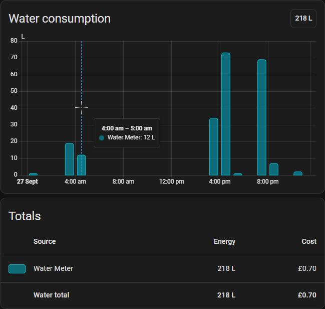
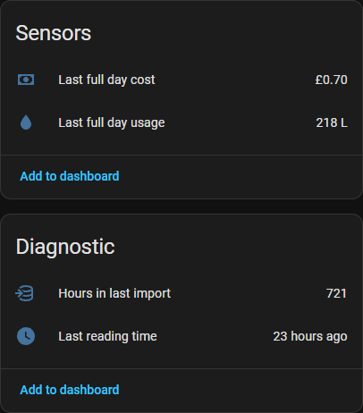

# Northumbrian Water for Home Assistant

Pulls hourly water consumption and cost data from the Northumbrian Water customer portal (`nwl.co.uk`) and writes it into Home Assistant's statistics, so it appears in the Energy dashboard's water section with each reading on the hour it actually belongs to.





## Requirements

- A Northumbrian Water online account with a **smart meter**.
- Home Assistant **2025.8 or newer**.

## How to Install

### HACS (recommended)

[](https://my.home-assistant.io/redirect/hacs_repository/?owner=Garywoo&repository=ha-northumbrian-water&category=integration)

The button opens this repository in HACS on your own Home Assistant, which covers steps 1 to 3. Download it, restart Home Assistant, then continue from step 4. To add it by hand instead:

1. In HACS, open the overflow menu (⋮) and choose **Custom repositories**.
2. Add `https://github.com/Garywoo/ha-northumbrian-water` with type **Integration**.
3. Search HACS for **Northumbrian Water**, download it, then restart Home Assistant.
4. Go to **Settings > Devices & services > Add integration** and search for **Northumbrian Water**, or use this button:

   [](https://my.home-assistant.io/redirect/config_flow_start/?domain=northumbrian_water)

5. Enter the email address and password you use on the website.

### Manual

1. Copy `custom_components/northumbrian_water` into your Home Assistant `config/custom_components/` directory, so you end up with
   `config/custom_components/northumbrian_water/manifest.json`.
2. Restart Home Assistant.
3. Continue from step 4 above.

Setup discovers the account, premise and meter serial automatically. If the login covers more than one meter you get to pick one; add the integration again to track another.

### Add it to the Energy dashboard

Go to **Settings > Dashboards > Energy > Water consumption > Add water source** and pick **Water consumption (&lt;meter serial&gt;)**, the statistic whose id is `northumbrian_water:water_<meter serial>`. It is in litres.

When it then offers to track costs, pick **Use an entity tracking the total costs**, then select **Water cost (&lt;meter serial&gt;)** (`northumbrian_water:water_cost_<meter serial>`). Despite the option's wording this is a statistic, not an entity. The portal returns a cost alongside every hourly reading, so this is the supplier's own figure rather than a rate guessed at locally, and it stays correct when the tariff changes.

Pick the *statistics* above, not one of this integration's sensors. The consumption history is not an entity (see [What it creates](#what-it-creates)). The data goes straight into the statistics tables. The sensors are deliberately set up so the Energy dashboard does not offer them as a source.

## How it behaves

- **Readings arrive late.** The portal publishes smart meter reads a day or two after the fact, and occasionally backfills an hour it had previously reported as empty. The integration therefore refreshes every 6 hours and re-imports a rolling window (10 days by default, adjustable from 2 to 60 under the integration's **Configure** button), recomputing the running total each time. The first refresh after a restart reaches back 30 days.

- **Clock changes are handled.** The NWL portal reports the *end* of each hour as a naïve UK wall-clock time, so it is resolved to an instant before an hour is subtracted. Doing it the other way round breaks the spring change, where the first row of the day is stamped 02:00 because 00:00-01:00 GMT ends when the clock reads 02:00 BST. In March that gives a 23 hour day. In October the portal returns 24 rows for the 25 hour day, publishing nothing for one half of the repeated hour, so that day has a real one hour gap. Both shapes were taken from the live API and are covered by tests.

- **Costs are rounded to the penny per hour, so the total runs slightly low.** The portal rounds each hourly `MonetaryValue` to two decimals, so an hour using a litre or two reports `0.00` and its fraction of a penny is lost. When I calculated it on my account, the shortfall came to about £2 a year.
	- Note that this is the volumetric charge only, as shown on the usage graph. It excludes standing charges, so it is not a bill forecast.

- **Daily totals can differ from the website by up to one hour's usage.** The portal's daily graph buckets consumption by *UTC* day while its hourly data is stamped in UK local time, so during British Summer Time its own two views disagree by exactly the 00:00-01:00 local hour. In winter, they agree. This integration attributes each hour to the local day it falls in, which is what the Energy dashboard expects, so it follows the hourly data rather than reproducing the daily graph.

## What it creates

The config entry is titled `Account Number <account number>` (with the meter serial appended if the login covers more than one meter), so the Integrations page identifies which account is being billed. One device per meter, named `NWL Water Meter (<serial>)`, carrying:

| Entity | Purpose |
| --- | --- |
| `sensor.*_last_full_day_usage` | Total for the most recent **complete** day, in litres. |
| `sensor.*_last_full_day_cost` | Cost of the most recent complete day, in GBP. |
| `sensor.*_last_reading_time` | Timestamp of the most recent hour imported - how far the data actually reaches. Diagnostic, **disabled by default**. |
| `sensor.*_hours_in_last_import` | Hours written by the last refresh, with both statistic ids as attributes. Diagnostic, **disabled by default**. |

The two diagnostics are off unless you turn them on, from the entity's settings on the device page. They are worth enabling if the Energy dashboard ever looks wrong: `last_reading_time` shows whether the portal is still publishing, and `hours_in_last_import` shows whether the last refresh wrote anything. Note that `hours_in_last_import` counts the last refresh's *window*, not the whole history, so it reads around 700 just after a restart or reload (30 day re-import) and around 240 on routine refreshes (11 day window).

The consumption history itself is not an entity. It lives in the statistics table under `northumbrian_water:water_<meter serial>`, which is what the Energy dashboard reads.

## Troubleshooting

Turn on debug logging:

```yaml
logger:
  default: warning
  logs:
    custom_components.northumbrian_water: debug
```

Then download diagnostics from the integration's overflow menu; identifiers are redacted.

- **"Sign-in was refused"** - check the credentials on the website first. After several failed attempts the portal requires a CAPTCHA that this integration cannot answer; wait, then sign in on the website to clear it. If your password changes, Home Assistant prompts you to sign in again.
- **No data in the Energy dashboard** - check `sensor.*_hours_in_last_import`. If it is 0, the portal has not published anything yet for the window.
- **Nothing at all for a new smart meter** - the portal takes a while to start publishing after installation. In my experience this can be months.

## Development

API notes, architecture and the test tools are documented separately in [the developer guide](docs/DEVELOPMENT.md).

## Unofficial

This is not affiliated with or endorsed by Northumbrian Water. It relies on undocumented endpoints that can change without warning.
